# Freshdesk Customer Support Implementation for Gochelicious Restaurant

> A practical customer support solution demonstrating End-to-end Freshdesk implementation for Gochelicious Restaurant, including ticket management, SLA policies, workflows, knowledge base, automation, and customer support documentation.

---

## 📖 Project Overview

This project showcases the design and implementation of a modern customer support centre using **Freshdesk**.

The goal is to demonstrate how a growing business can centralise customer support, improve response times, automate repetitive tasks, and deliver an excellent customer experience through well-designed support processes.

Rather than serving as a software tutorial, this repository is structured as a business implementation project based on industry best practices.

---

## 🎯 Project Objectives

- Deliver a structured customer support workflow
- Improve customer response and resolution times
- Standardise support processes
- Reduce repetitive manual tasks through automation
- Build a searchable customer knowledge base
- Improve customer satisfaction
- Provide meaningful support metrics for decision-making

---

## 🛠 Platform

- Freshdesk
- Microsoft 365
- Google Workspace
- Notion

---

## 📂 Repository Structure

```text
freshdesk-support-center/
│
├── README.md
├── documentation/
├── screenshots/
├── workflows/
├── templates/
└── assets/
```

---

## ⚙ Features Implemented

### Ticket Management

- Ticket creation
- Ticket prioritisation
- Ticket categorisation
- Ticket assignment
- Status management
- Escalation workflow

### Knowledge Base

- Frequently Asked Questions
- Help Centre Articles
- Internal Agent Documentation

### Workflow Automation

- Automatic ticket assignment
- SLA reminders
- Priority rules
- Status updates
- Email notifications

### Customer Success

- Customer communication workflows
- Customer satisfaction process
- Support lifecycle
- Follow-up procedures

### Reporting

- Ticket volume
- Response time
- Resolution time
- SLA compliance
- Customer satisfaction metrics

---

## 📈 Business Value

Implementing a structured support centre enables organisations to:

- Respond to customers more efficiently
- Improve consistency across support teams
- Reduce operational workload
- Increase customer satisfaction
- Make better decisions using support data
- Scale customer support as the business grows

---

## 🚀 Future Enhancements

- AI-assisted ticket routing
- Omnichannel support
- Customer self-service portal
- Advanced reporting dashboards
- CRM integration
- Workflow optimisation

---

## 📚 Skills Demonstrated

- Customer Success
- Customer Support Operations
- Freshdesk Administration
- Workflow Design
- Knowledge Base Management
- Business Process Documentation
- Process Improvement
- Digital Operations

---

# 📸 Implementation Screenshots

The following screenshots showcase the Freshdesk implementation for Gochelicious Restaurant, demonstrating the configuration, automation, ticket management, reporting, customer support tools, and knowledge base created as part of this project.

---

## ⚙️ Configuration

The Freshdesk environment was configured with custom ticket fields, support groups, agent roles, and SLA policies to support restaurant operations.

| Ticket Fields | SLA Policy |
|---------------|------------|
| 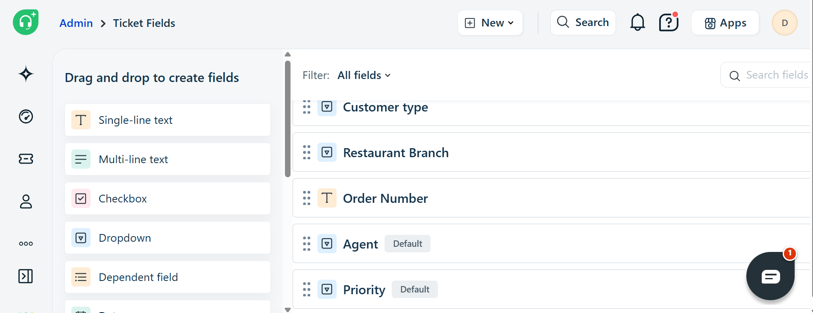 | 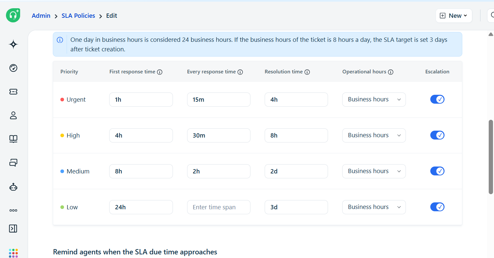 |

| Agent Groups | Agent Roles |
|--------------|-------------|
| 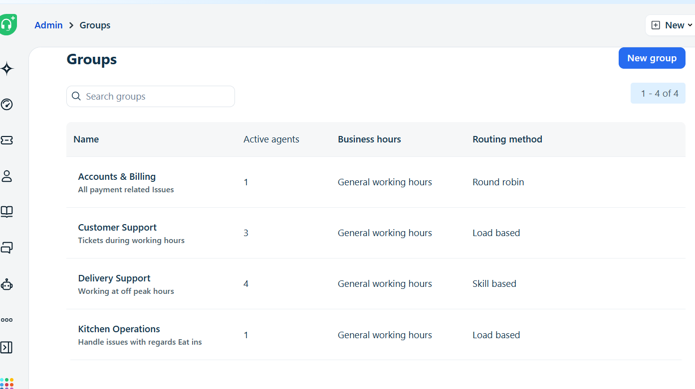 | 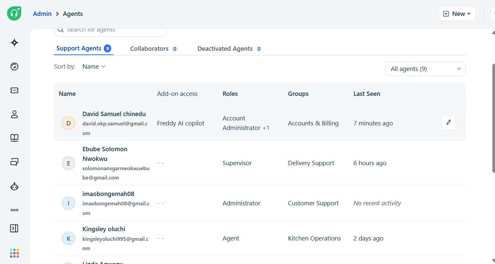 |

---

## 🤖 Workflow Automation

Automation rules were implemented to route tickets, enforce SLAs, and reduce manual support work.

| Delivery Ticket Assignment | Billing Ticket Assignment |
|----------------------------|---------------------------|
| 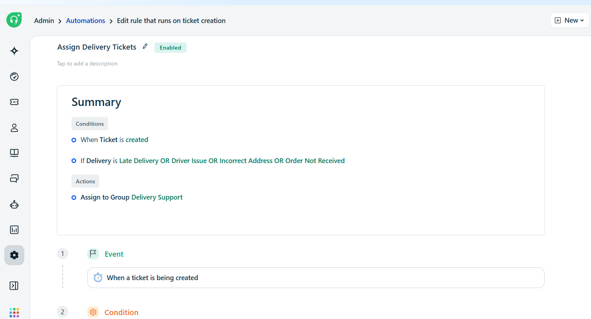 | 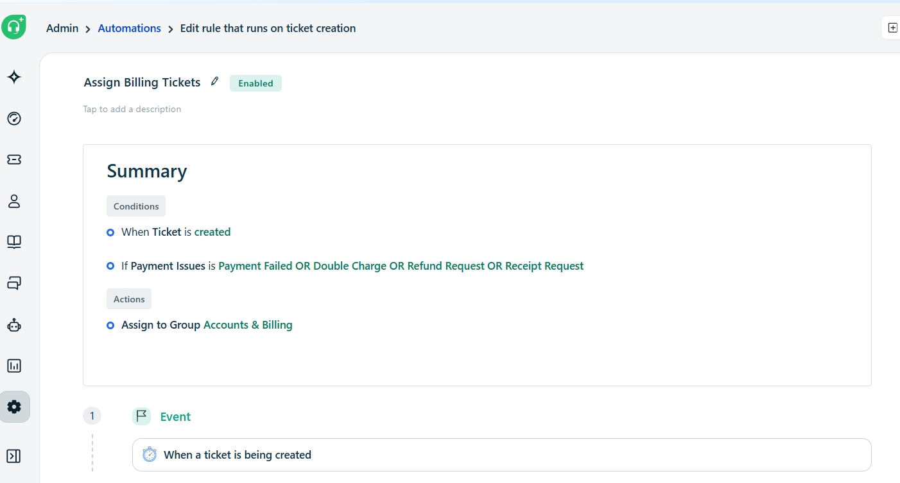 |

| Escalation Rule | Auto-close Rule |
|-----------------|-----------------|
| 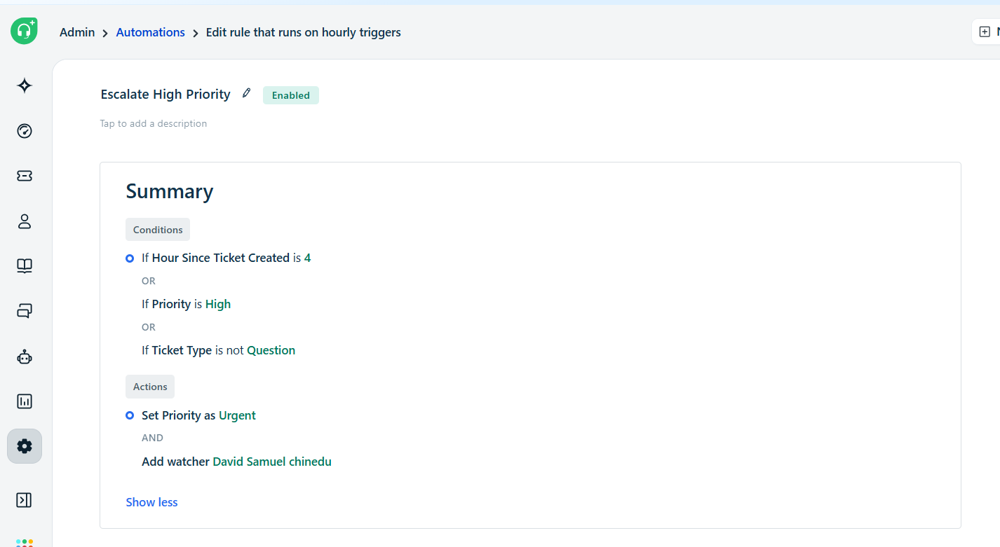 | 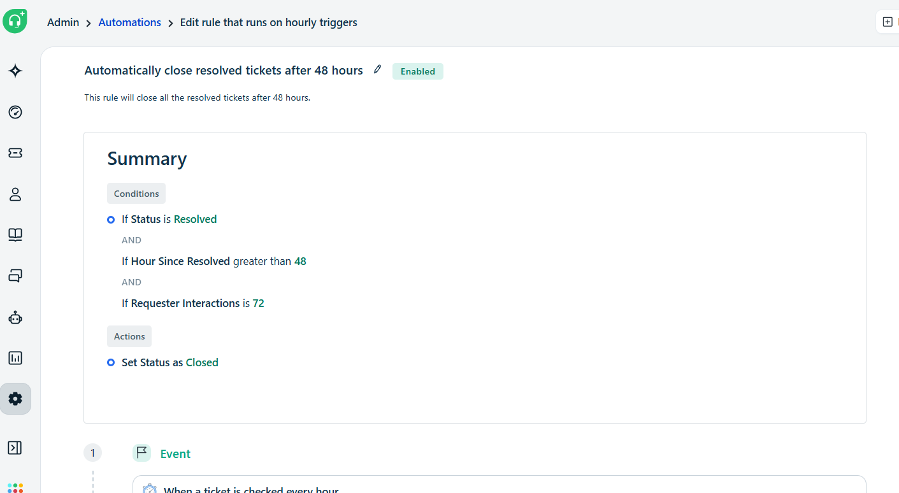 |

---

## 🎫 Ticket Management

These screenshots demonstrate the complete lifecycle of a support ticket, from creation through resolution.

| New Ticket Form | Ticket List |
|-----------------|-------------|
| 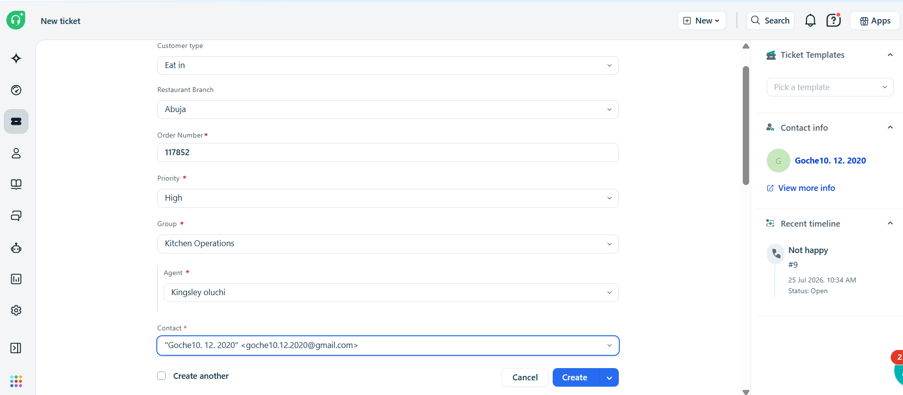 | 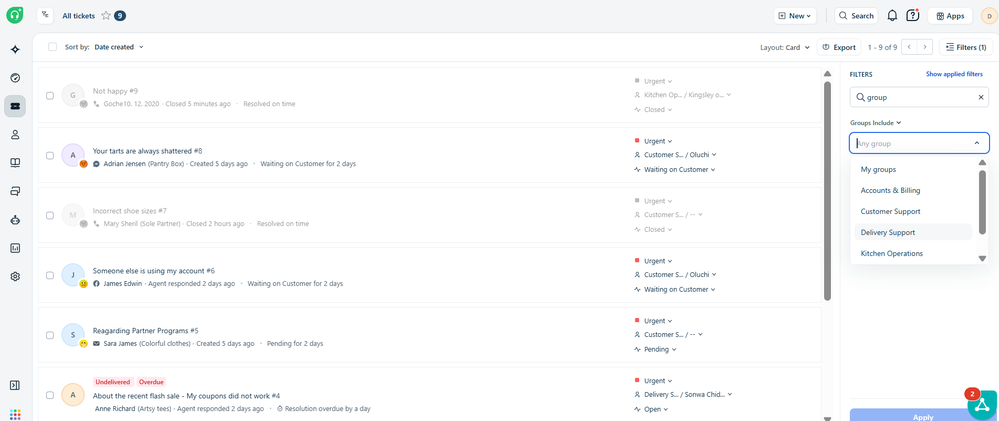 |

| Ticket Details | Closed Ticket* |
|----------------|----------------|
| 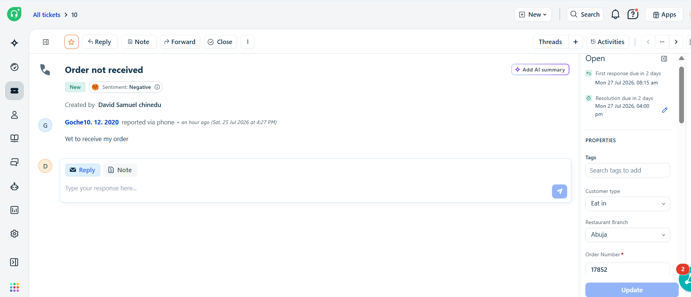 | 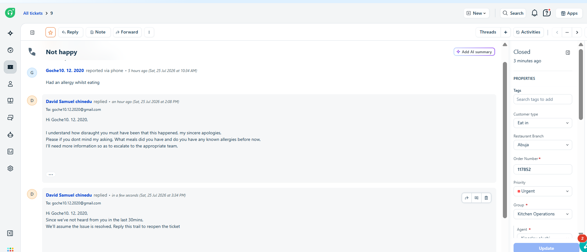 |

---

## 📊 Analytics

Freshdesk dashboards and reports provide visibility into team performance and customer support metrics.

| Operations Dashboard | Support Overview Report |
|----------------------|-------------------------|
| 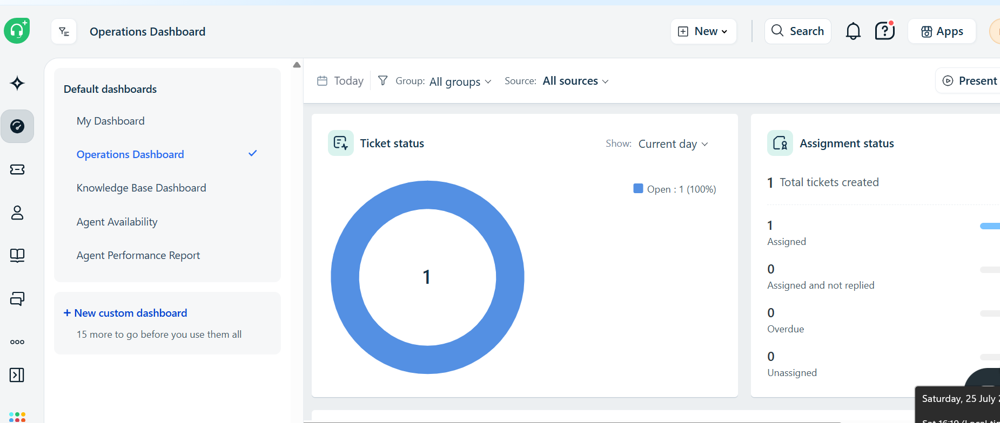 | 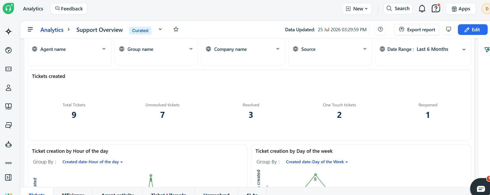 |

---

## 💬 Customer Support

Prepared customer communication templates help agents deliver faster and more consistent responses.

| Canned Responses | Canned Response Details |
|------------------|-------------------------|
| 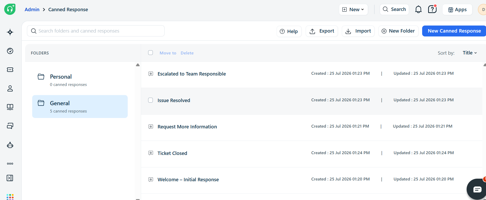 | 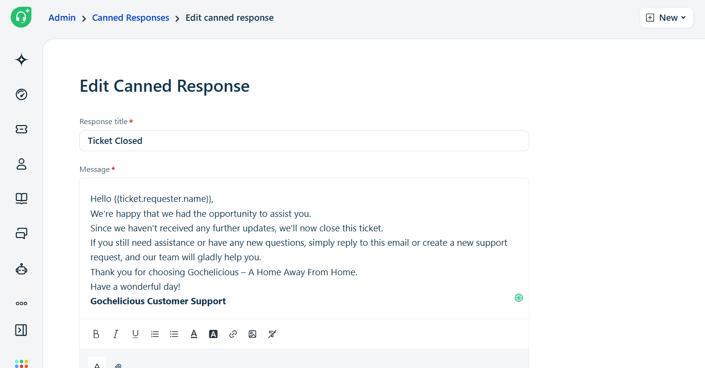 |

---

## 📚 Knowledge Base

The knowledge base enables customers to find answers independently while reducing support requests.

| Knowledge Base Home | Contact Support Article |
|---------------------|-------------------------|
| 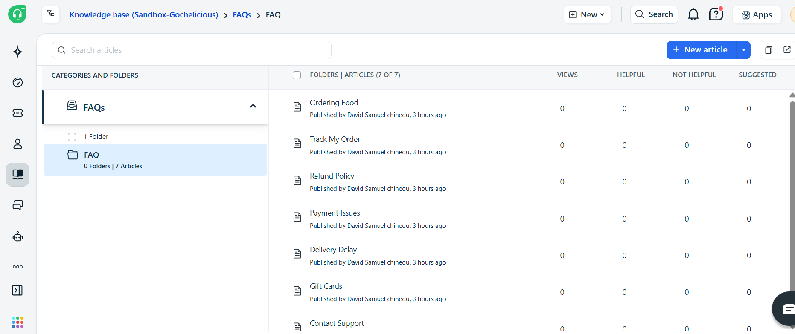 | 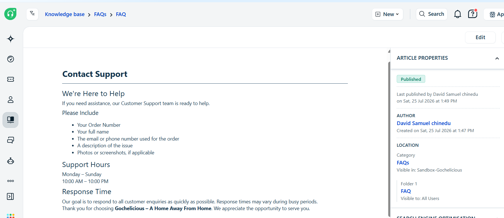 |

# 📁 Project Assets

This repository contains:

- Business documentation
- Support workflows
- Email templates
- Knowledge base articles
- Freshdesk implementation screenshots
- Customer support documentation
 
  ---

# 🎓 Learning Outcomes

This implementation demonstrates practical experience with:

- Freshdesk Administration
- Customer Support Operations
- Workflow Automation
- SLA Management
- Knowledge Base Administration
- Customer Success
- Business Process Design
- CRM Implementation

## Repository

🔗 GitHub Repository

https://github.com/cbmaduka/freshdesk-support-center
  
## 👤 Author

**Chika Blessing**

Operations • Customer Success • CRM • Project Management • Success Partner

---

*Same warmth, wherever you find me*
